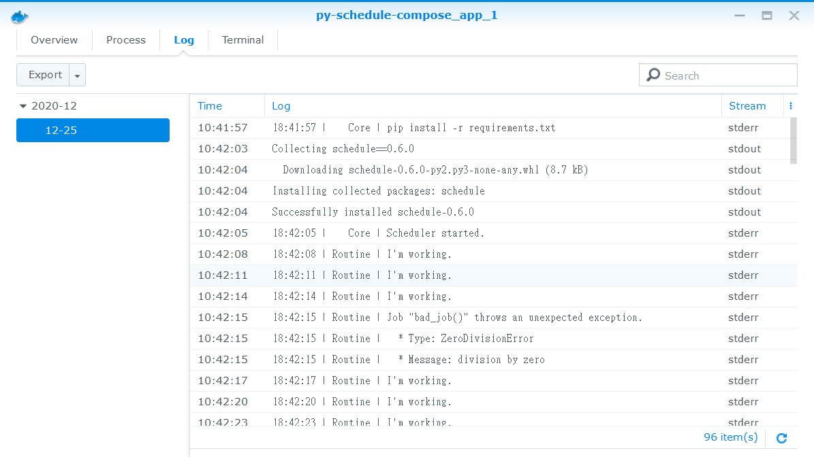
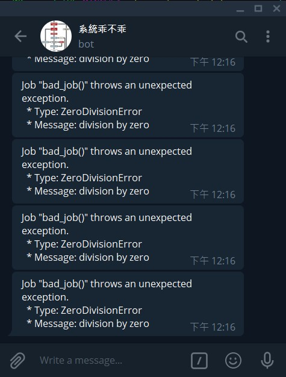

# py-schedule-compose

A better way to implement Python [schedule](https://schedule.readthedocs.io/en/stable/) module.

I'd just like to run several spiders on my NAS, so create this repository to test.

## Features

* Handle unexpected exceptions.
* Support parallel execution.
* Run pip install automatically.
* Stop container gracefully.
* Telegram bot integrated.

## Get started

#### Create .env file.

```
cp .env.default .env
```

#### Run container.

```
docker-compose up -d
```

#### What's happened?

There are two default jobs in the project:

* good_job(): run per 3 seconds.
* bad_job(): run per 10 seconds and throw an unhandled exception.

#### Screenshot

The following screenshot is captured from Synology DS218+.



#### Remove container

```
docker-compose down -v
```

Option -v is required, so that the volume for temp file would be removed also.

Without -v, pip install won't be run next time. 

## Make your own job

#### Add a job.

```python
# TODO
```

#### Add a job which using 3rd party package.

```python
# TODO
```

#### Add a job to generate some data.

```python
# TODO
```

#### Set Telegram bot to received unexpected exception.

Edit these variables in .env file.

```ini
TG_BOT={{YOUR BOT APIKEY}}
TG_TO={{YOUR ACCOUNT or GROUP}}
```

And rebuild container.

```
docker-compose down -v
docker-compose up -d
```

It the two variables are set, a telegram message would be sent while unexpected exception detected.



#### Set timezone.

Edit TIMEZONE variable in .env file.

```ini
TIMEZONE=Asia/Taipei
```

And rebuild container.

```
docker-compose down -v
docker-compose up -d
```
